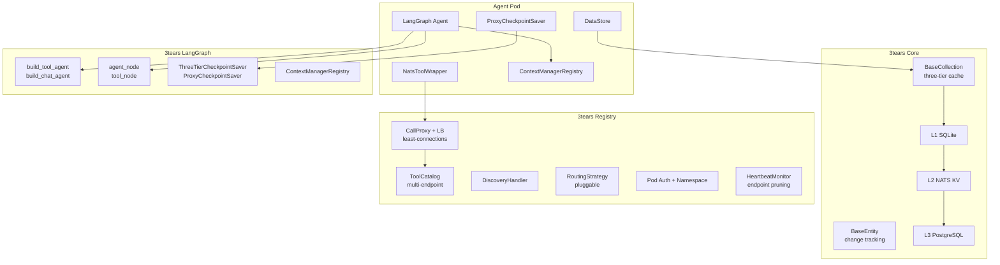

# 3tears

Three-tier data framework for Python applications with LLM agent support.

## Packages

| Package | PyPI | Import | Description |
|---------|------|--------|-------------|
| [3tears](packages/core/) | `pip install 3tears` | `threetears.core` | Three-tier entities, collections, caching (L1 SQLite, L2 NATS KV, L3 PostgreSQL), DataStore, migrations |
| [3tears-observe](packages/observe/) | `pip install 3tears-observe` | `threetears.observe` | Structured logging, OpenTelemetry tracing, `@traced` decorator |
| [3tears-agent-memory](packages/agent-memory/) | `pip install 3tears-agent-memory` | `threetears.agent.memory` | Memory extraction, retrieval, hybrid search for LLM agents |
| [3tears-agent-tools](packages/agent-tools/) | `pip install 3tears-agent-tools` | `threetears.agent.tools` | TearsTool ABC, ToolServer (NATS), ToolContextManager, built-in tools |
| [3tears-langgraph](packages/langgraph/) | `pip install 3tears-langgraph` | `threetears.langgraph` | LangGraph integration: checkpoint savers, graph builders, context registry |
| [3tears-registry](packages/registry/) | `pip install 3tears-registry` | `threetears.registry` | Tool registry: multi-pod catalog, discovery, load-balanced call proxy (least-connections), heartbeat monitor, pod auth, pluggable routing strategies |

## Architecture



## Core Package (`threetears.core`)

### Three-Tier Entities

```python
from threetears.core import BaseEntity, BaseCollection, CollectionRegistry

# Entities are smart objects with change tracking
entity = await collection.get(entity_id)
entity.name = "updated"       # change tracked via __setattr__
await entity.save()           # persists through L1 → L2 → L3

# Subscript access
collection[entity_id]                  # full entity
collection[entity_id, "field_name"]    # single field
collection[entity_id, "field"] = val   # set field
```

### DataStore — Dynamic Tables

```python
from threetears.core.data import DataStore, TableDef, ColumnDef, IndexDef, ForeignKeyDef, MigrationRunner

store = DataStore(agent_id=agent_id, registry=registry)

# Create tables with FK constraints and indexes
await store.create_table(TableDef(
    name="survey_responses",
    columns=[
        ColumnDef(name="id", column_type="uuid", primary_key=True),
        ColumnDef(name="user_id", column_type="uuid", nullable=False),
        ColumnDef(name="answer", column_type="text"),
    ],
    indexes=[IndexDef(name="idx_user", columns=["user_id"])],
))

# Three-tier entity access
store["survey_responses"][response_id]              # full entity
store["survey_responses"][response_id, "answer"]    # single field

# Schema migrations
migrations = MigrationRunner(store)

@migrations.version(1)
async def v1(store):
    await store.create_table(TableDef(...))

@migrations.version(2)
async def v2(store):
    await store.execute("ALTER TABLE surveys ADD COLUMN email TEXT")

await store.run_migrations(migrations)
```

## LangGraph Package (`threetears.langgraph`)

### Graph Builders

```python
from threetears.langgraph import build_tool_agent, build_chat_agent

# Tool-calling agent
graph = build_tool_agent(system_prompt="You are helpful.", max_iterations=10)
compiled = graph.compile(checkpointer=saver)

# Config keys: chat_model, tools, system_prompt, context_manager, data_store, thread_id
```

### Checkpoint Savers

```python
from threetears.langgraph import ThreeTierCheckpointSaver, ProxyCheckpointSaver

# Direct DB access (Hub, Gateway)
saver = ThreeTierCheckpointSaver(postgres_pool=pool)

# Sandboxed agents (no DB credentials)
saver = ProxyCheckpointSaver(executor=nats_l3_adapter)
```

### Context Memory

```python
from threetears.langgraph import ContextManagerRegistry, current_conversation_id

registry = ContextManagerRegistry(context_collection=collection)
current_conversation_id.set(str(conversation_id))

await registry.save_tool_result("search", result, "found 5 matches")
prompt = registry.build_context_prompt()  # injected into system message
```

## Development

```bash
uv sync                      # install all packages in dev mode
./scripts/check-all.sh       # lint + typecheck + tests
./scripts/test.sh             # tests only
./scripts/test.sh core        # single package
./scripts/lint.sh             # ruff check + format
./scripts/typecheck.sh        # mypy strict
```
