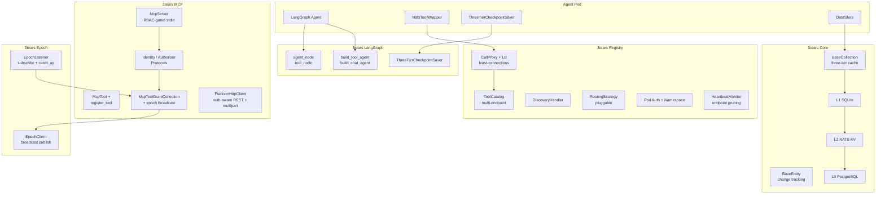

# 3tears

Three-tier data framework for Python applications with LLM agent support.

## Packages

The `agent-*` family lives under the `packages/agent/` namespace dir for visual grouping (each entry is still its own independently-versioned uv workspace member). Top-level packages live directly under `packages/`.

| Package | PyPI | Import | Description |
|---------|------|--------|-------------|
| [3tears](packages/core/) | `pip install 3tears` | `threetears.core` | Three-tier entities, collections, caching (L1 SQLite, L2 NATS KV, L3 PostgreSQL), DataStore, canonical `MigrationRunner` (platform + agent scopes, multi-package composition, topological ordering; retires alembic per `docs/migrations-task-01-canonical-runner.md`) |
| [3tears-enforcement](packages/enforcement/) | `pip install 3tears-enforcement` | `threetears.enforcement` | Shared enforcement-test utilities (datetime-aware audit, naming conventions, dict-state detection, schema-agreement). Extracted in v0.5.0 task-00 to eliminate ~5-6k lines of cross-repo duplication |
| [3tears-observe](packages/observe/) | `pip install 3tears-observe` | `threetears.observe` | Structured logging, OpenTelemetry tracing, `@traced` decorator, `set_context` / `clear_context` ContextVar-backed tags. Includes the `CorrelationMiddleware` ASGI middleware promoted from metallm/aibots in v0.6.0 task-07 |
| [3tears-nats](packages/nats/) | `pip install 3tears-nats` | `threetears.nats` | Typed NATS client (`NatsClient`), `Subjects` builders, `IncomingMessage` envelope, `PublishError` / `RequestError` / `SubscribeError`, JetStream KV bucket helper. Single canonical wrapper retired the per-product NatsClient composition wrappers in v0.6.0 task-07.8 |
| [3tears-epoch](packages/epoch/) | `pip install 3tears-epoch` | `threetears.epoch` | Generation-stamped config epochs with NATS broadcast (push) + per-message epoch echo (pull-on-stale). `EpochClient` + `EpochListener` underpin every cross-pod cache reload — capabilities registry, MCP RBAC, gateway catalog. v0.6.0 platform-followups task-02 |
| [3tears-mcp](packages/mcp/) | `pip install 3tears-mcp` | `threetears.mcp` | Shared MCP (Model Context Protocol) framework: `McpServer` (RBAC-gated wrapper over the official mcp.server SDK), `McpTool` + `register_tool` decorator, `PlatformHttpClient` (auth-aware REST client with refresh-on-401 + multipart upload), `Identity` / `IdentityProvider` / `Authorizer` Protocols + `EnvVarIdentityProvider` + `LocalGrantAuthorizer`, `McpToolGrantCollection` over `mcp_tool_grants`. Per-product MCP servers (metallm 23 tools, aibot-hub 6, agent-admin 13) compose this framework rather than reimplementing transport / auth / RBAC. v0.6.0 platform-followups task-03 |
| [3tears-agent-acl](packages/agent/acl/) | `pip install 3tears-agent-acl` | `threetears.agent.acl` | Unified RBAC evaluator + cache (Groups, Roles, Assignments). `evaluate_decision` hot path + `evaluate_with_trail` introspection path; three-layer `AclCache` with invalidation hooks; `GrantLoader` / `MembershipLoader` protocols. Audit vocabulary tuples (`audit_vocabulary.py`) are publish-side validation machinery only — this package does NOT publish its own audit envelope; rbac emission sites call `threetears.agent.audit.publish_audit` directly (audit-task-01 Phase 4 retired `RbacAuditEnvelope`). Pure Python, no NATS or postgres. Produced by `rbac-task-01`; same evaluator runs in hub broker and every agent pod |
| [3tears-agent-audit](packages/agent/audit/) | `pip install 3tears-agent-audit` | `threetears.agent.audit` | Unified `AuditEvent` envelope + `publish_audit` fire-and-forget helper used by every domain (workspace, rbac, memory, tool dispatch). One wire format, one subject tree (`{ns}.audit.{event_type}`), one consumer, one admin query API. Produced by `audit-task-01` (Phases 1-5); replaces the per-domain `WorkspaceAuditEnvelope` / `RbacAuditEnvelope` (both deleted). Pure Python, no NATS consumer or postgres code |
| [3tears-conversations](packages/conversations/) | `pip install 3tears-conversations` | `threetears.conversations` | `Conversation` entity + `ConversationsCollection` (three-tier) + agent-scope migration entry point. Split out of agent-memory in `workspace-task-19` / `migrations-task-01` because memory, context items, and workspace bindings all key off `conversation_id` |
| [3tears-agent-memory](packages/agent/memory/) | `pip install 3tears-agent-memory` | `threetears.agent.memory` | Memory extraction, retrieval, hybrid search for LLM agents. `conversations` now lives in `3tears-conversations`; memory depends on it. `EmbeddingProvider` Protocol retired in v0.6.x cleanup — consumers subclass `langchain_core.embeddings.Embeddings` directly. Migration v014 renamed `conversation_memory_refs.date_added` → `date_created` to align with the standard `(date_created, date_updated)` convention every other 3tears table uses |
| [3tears-agent-tools](packages/agent/tools/) | `pip install 3tears-agent-tools` | `threetears.agent.tools` | `TearsTool` base (`mcp_schema`, `mcp_name`, `mcp_version`, `execute`), `ToolServer` (NATS registration, call subscription, heartbeat; emits a baseline `event_type='tool.call'` unified audit envelope via `publish_audit` on every dispatch — success, failure, error — introduced in `audit-task-01` Phase 3), `ToolContextManager`, built-in tools, `CallContext` envelope (unified identity plumbing from `context-task-01`; carries `user_timezone` / `user_locale` resolved per-message by channel adapters) + `bind_log_context`, `ToolProvisioningStrategy` protocol (`DevInProcessStrategy` / `ProdExternalPodsStrategy` live in the SDK), `aliases` module declaring tool group sets (`standard`, `web`, `media`, `workspace`, `workspace.fs/doc/lifecycle`) and the `expand_selectors` resolver the SDK calls at agent.yaml load time to flatten group aliases into concrete tool name lists |
| [3tears-agent-workspace](packages/agent/workspace/) | `pip install 3tears-agent-workspace` | `threetears.agent.workspace` | Workspace tools, sandbox, namespace-routed L3 access. `authorize_workspace_access` delegates to `3tears-agent-acl` — no workspace-specific ACL code. Audit emission goes through the generic `threetears.agent.audit.publish_audit` helper plus the `ToolServer` baseline; this package does NOT publish its own audit envelope (audit-task-01 Phase 3 retired `WorkspaceAuditEnvelope`) |
| [3tears-langgraph](packages/langgraph/) | `pip install 3tears-langgraph` | `threetears.langgraph` | LangGraph integration: checkpoint savers, graph builders, context registry |
| [3tears-registry](packages/registry/) | `pip install 3tears-registry` | `threetears.registry` | Multi-pod tool routing: `RegistrationHandler`, `ToolCatalog` (NATS KV-backed), `DiscoveryHandler`, `CallProxy` (per-tool `timeout_seconds` propagation, nested `CallContext` pass-through), `HeartbeatMonitor`, `RegistryServer` convenience runner, pluggable routing strategies |
| [3tears-models](packages/models/) | `pip install 3tears-models` | `threetears.models` | LangChain-native model adapters (v0.6.0 task-02 retired the `ChatProvider` / `EmbeddingProvider` / `TranscriptionProvider` / etc. runtime protocols in favour of `BaseChatModel` / `Embeddings` subclasses). Providers: Anthropic, OpenAI, OpenRouter, VoyageAI, Whisper, OpenAI Images, HuggingFace Images, A1111, ModelsLab, ComfyUI. Unified `UsageTracker.record()` (v0.6.0 task-07.5) emits OTel span + Prometheus instruments + optional `UsageAuditSink` / `UsageCounterSink` per-product fan-out. Circuit breaker, error translation, message preprocessing, streaming utilities, capability registry |
| [3tears-channels](packages/channels/) | `pip install 3tears-channels` | `threetears.channels` | Message protocol, Slack and Discord adapters, WebSocket handler |

## Architecture



## Core Package (`threetears.core`)

### Three-Tier Entities

```python
from threetears.core import BaseEntity, BaseCollection, CollectionRegistry

# Entities are smart objects with change tracking
entity = await collection.get(entity_id)
entity.name = "updated"       # change tracked via __setattr__
await entity.save()           # persists through L1 → L2 → L3

# Subscript access
collection[entity_id]                  # full entity
collection[entity_id, "field_name"]    # single field
collection[entity_id, "field"] = val   # set field
```

### DataStore — Dynamic Tables

```python
from threetears.core.data import DataStore, TableDef, ColumnDef, IndexDef, ForeignKeyDef, MigrationRunner

store = DataStore(agent_id=agent_id, registry=registry)

# Create tables with FK constraints and indexes
await store.create_table(TableDef(
    name="survey_responses",
    columns=[
        ColumnDef(name="id", column_type="uuid", primary_key=True),
        ColumnDef(name="user_id", column_type="uuid", nullable=False),
        ColumnDef(name="answer", column_type="text"),
    ],
    indexes=[IndexDef(name="idx_user", columns=["user_id"])],
))

# Three-tier entity access
store["survey_responses"][response_id]              # full entity
store["survey_responses"][response_id, "answer"]    # single field

# Schema migrations
migrations = MigrationRunner(store)

@migrations.version(1)
async def v1(store):
    await store.create_table(TableDef(...))

@migrations.version(2)
async def v2(store):
    await store.execute("ALTER TABLE surveys ADD COLUMN email TEXT")

await store.run_migrations(migrations)
```

## LangGraph Package (`threetears.langgraph`)

### Graph Builders

```python
from threetears.langgraph import build_tool_agent, build_chat_agent

# Tool-calling agent
graph = build_tool_agent(system_prompt="You are helpful.", max_iterations=10)
compiled = graph.compile(checkpointer=saver)

# Config keys: chat_model, tools, system_prompt, context_manager, data_store, thread_id
```

### Checkpoint Saver

```python
from threetears.langgraph import (
    AsyncpgPoolAdapter,
    ThreeTierCheckpointSaver,
)

# Direct DB access (Hub, Gateway) — wrap the pool once
saver = ThreeTierCheckpointSaver(executor=AsyncpgPoolAdapter(pool))

# Sandboxed agents (no DB credentials) — NatsProxyL3Backend is
# already an AsyncQueryExecutor, pass it straight through
saver = ThreeTierCheckpointSaver(executor=nats_l3_backend)
```

### Context Memory

```python
from threetears.agent.tools.context import ToolContextManager

manager = ToolContextManager(
    collection=context_collection,
    conversation_id=conversation_id,
    user_id=user_id,
)
await manager.save_tool_result("search", result, "found 5 matches")
prompt = manager.build_context_prompt()  # injected into system message
```

## Development

```bash
uv sync                      # install all packages in dev mode
./scripts/check-all.sh       # lint + typecheck + tests
./scripts/test.sh             # tests only
./scripts/test.sh core        # single package
./scripts/lint.sh             # ruff check + format
./scripts/typecheck.sh        # mypy strict
```
