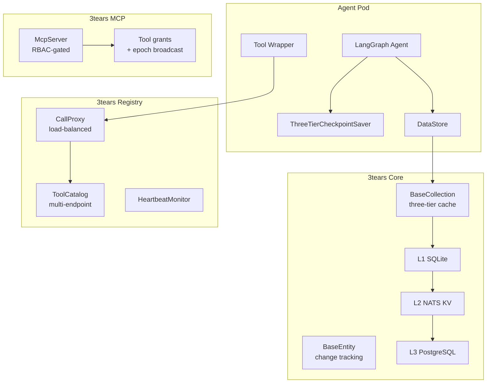

# 3tears

**Smart data objects with a three-tier cache underneath. L1 SQLite. L2 NATS KV. L3 PostgreSQL.**

[](LICENSE)
[](https://www.python.org/downloads/)
[](#project-status)

Reads stay local and fast. Writes flow through to durable storage. Your objects track their own changes and persist themselves.

On that foundation sits an optional toolkit for building distributed LLM agents. Memory. Tools. RBAC. Model adapters. Channel integrations. LangGraph checkpointing. Take the whole stack or just the cache underneath it. The core stands on its own.

3tears ships as a family of namespace packages, each versioned in lockstep, each installable on its own.

## Project status

3tears is alpha. The `0.x` line runs in production internally, but the public API can shift between minor versions until `1.0.0`. Pin your dependencies. Python 3.14+ required.

## Install

```bash
pip install 3tears              # core three-tier framework
pip install 3tears-agent-memory # agent memory
pip install 3tears-models       # LangChain-native model adapters
# ... or any other package from the table below
```

## Quickstart

### Smart entities that track their own changes

```python
from threetears.core import BaseEntity, BaseCollection, CollectionRegistry

# Attribute writes are change-tracked. save() persists through L1, L2, L3.
entity = await collection.get(entity_id)
entity.name = "updated"        # tracked via __setattr__
await entity.save()            # writes through every tier

# Subscript access for fields
collection[entity_id]                   # full entity
collection[entity_id, "field_name"]     # single field
collection[entity_id, "field"] = value  # set field
```

### Dynamic tables with the DataStore

```python
from threetears.core.data import (
    DataStore, TableDef, ColumnDef, IndexDef, MigrationRunner,
)

store = DataStore(agent_id=agent_id, registry=registry)

await store.create_table(TableDef(
    name="survey_responses",
    columns=[
        ColumnDef(name="id", column_type="uuid", primary_key=True),
        ColumnDef(name="user_id", column_type="uuid", nullable=False),
        ColumnDef(name="answer", column_type="text"),
    ],
    indexes=[IndexDef(name="idx_user", columns=["user_id"])],
))

# Three-tier entity access through the store
store["survey_responses"][response_id]            # full entity
store["survey_responses"][response_id, "answer"]  # single field

# Versioned schema migrations
migrations = MigrationRunner(store)

@migrations.version(1)
async def v1(store):
    await store.create_table(TableDef(...))

@migrations.version(2)
async def v2(store):
    await store.execute("ALTER TABLE surveys ADD COLUMN email TEXT")

await store.run_migrations(migrations)
```

### LangGraph agents with three-tier checkpointing

```python
from threetears.langgraph import build_tool_agent, ThreeTierCheckpointSaver, AsyncpgPoolAdapter

graph = build_tool_agent(system_prompt="You are helpful.", max_iterations=10)
saver = ThreeTierCheckpointSaver(executor=AsyncpgPoolAdapter(pool))
compiled = graph.compile(checkpointer=saver)
```

## Packages

Every package shares the `threetears.*` import namespace and installs independently. The `agent-*` family lives under `packages/agent/` for grouping. Each one is still its own PyPI distribution.

### Core data

| Package | Import | Description |
|---|---|---|
| [`3tears`](packages/core/) | `threetears.core` | Three-tier entities, collections, and caching. L1 SQLite, L2 NATS KV, L3 PostgreSQL. `DataStore` for dynamic tables. Canonical `MigrationRunner` with platform and agent scopes, multi-package composition, and topological ordering |
| [`3tears-conversations`](packages/conversations/) | `threetears.conversations` | `Conversation` entity, three-tier `ConversationsCollection`, and per-agent schema migrations |
| [`3tears-datasources`](packages/datasources/) | `threetears.datasources` | Datasource entities, collections, and a driver abstraction for PostgreSQL, Redshift, Snowflake, and BigQuery backends |

### Infrastructure

| Package | Import | Description |
|---|---|---|
| [`3tears-nats`](packages/nats/) | `threetears.nats` | Typed NATS client, subject builders, message envelopes, and JetStream KV bucket helpers |
| [`3tears-observe`](packages/observe/) | `threetears.observe` | Structured logging, OpenTelemetry tracing, a `@traced` decorator, ContextVar-backed tags, and ASGI correlation middleware |
| [`3tears-epoch`](packages/epoch/) | `threetears.epoch` | Generation-stamped config epochs with NATS broadcast and per-message echo, for coherent cross-pod cache reloads |
| [`3tears-mcp`](packages/mcp/) | `threetears.mcp` | A Model Context Protocol framework. RBAC-gated `McpServer`, `McpTool` plus `register_tool`, an auth-aware HTTP client, and pluggable identity and authorizer protocols |
| [`3tears-registry`](packages/registry/) | `threetears.registry` | Multi-pod tool routing. Registration, a NATS KV-backed catalog, discovery, a load-balancing call proxy, heartbeat monitoring, and pluggable routing strategies |
| [`3tears-scheduled-jobs`](packages/scheduled-jobs/) | `threetears.scheduled_jobs` | Payload-agnostic, multi-pod-safe scheduled-jobs engine. Cross-pod-locked tick loop, reschedule math, and store protocols |
| [`3tears-media-contracts`](packages/media-contracts/) | `threetears.media.contracts` | Dependency-free media capability contracts shared by providers and tools |
| [`3tears-enforcement`](packages/enforcement/) | `threetears.enforcement` | Static-analysis enforcement scanners and shared test utilities. Naming conventions, schema agreement, datetime-aware auditing |

### Agent framework

| Package | Import | Description |
|---|---|---|
| [`3tears-agent-tools`](packages/agent/tools/) | `threetears.agent.tools` | Tool framework. `TearsTool` base, `ToolServer` for NATS registration plus dispatch plus audit, context management, built-in tools, and tool-group aliases |
| [`3tears-agent-memory`](packages/agent/memory/) | `threetears.agent.memory` | Memory extraction, retrieval, hybrid search, and MMR reranking for LLM agents |
| [`3tears-agent-skills`](packages/agent/skills/) | `threetears.agent.skills` | Procedural memory. Skill definitions and invocation history |
| [`3tears-agent-workspace`](packages/agent/workspace/) | `threetears.agent.workspace` | Workspace entities, sandbox, format handlers, and namespace-routed L3 access |
| [`3tears-agent-acl`](packages/agent/acl/) | `threetears.agent.acl` | Unified RBAC evaluator and cache. Groups, roles, assignments, an evaluation hot path, and an introspection trail. Pure Python |
| [`3tears-agent-audit`](packages/agent/audit/) | `threetears.agent.audit` | One audit envelope and a fire-and-forget `publish_audit` helper, with a single wire format and subject tree across every domain |
| [`3tears-agent-wake`](packages/agent/wake/) | `threetears.agent.wake` | Foundation for long-running agents. Wake schedules, fires, and webhook subscriptions |

### Models, channels, LangGraph

| Package | Import | Description |
|---|---|---|
| [`3tears-models`](packages/models/) | `threetears.models` | LangChain-native model adapters. Anthropic, OpenAI, OpenRouter, VoyageAI, Whisper, and image providers, with capability metadata, circuit breakers, error translation, and unified usage tracking |
| [`3tears-channels`](packages/channels/) | `threetears.channels` | A unified message protocol with Slack, Discord, and WebSocket adapters |
| [`3tears-langgraph`](packages/langgraph/) | `threetears.langgraph` | LangGraph integration. Three-tier checkpoint savers, graph builders, and a context registry |

## Architecture



## Development

3tears is a [uv](https://docs.astral.sh/uv/) workspace.

```bash
uv sync                      # install all packages in dev mode
./scripts/check-all.sh       # lint + typecheck + tests
./scripts/test.sh            # tests only
./scripts/test.sh core       # a single package
./scripts/lint.sh            # ruff check + format
./scripts/typecheck.sh       # mypy (strict)
```

Use the scripts. Never invoke `pytest`, `ruff`, or `mypy` directly.

## Contributing

1. Fork the repository and cut a feature branch.
2. Write tests for new behavior. Tests are contracts here.
3. Run `./scripts/check-all.sh`. Everything passes or it does not ship.
4. Open a pull request.

## License

MIT. See [LICENSE](LICENSE).

## Developed with EAD

AI generates code faster than humans can review it. Architectural drift compounds. Type systems fragment. Verification becomes the bottleneck.

3tears was built with [Enforcement-Accelerated Development](https://doi.org/10.5281/zenodo.17968797), a methodology that makes AI-assisted development tractable. It encodes the rules a reviewer would otherwise enforce by hand.

**Three pillars:**

| Pillar | Implementation in 3tears |
|---|---|
| Context Sharding | Task docs in `docs/` at roughly 500 LOC each |
| Enforcement Tests | Static and AST verification in `tests/enforcement/` and the `3tears-enforcement` package |
| Evidence-Based Debugging | `function:line` context in structured logs via `3tears-observe` |

Violations caught at commit time. Not in production.

- [EAD Whitepaper](https://doi.org/10.5281/zenodo.17968797) -- the full methodology
- [Mark Pace](https://pace.org) -- author
