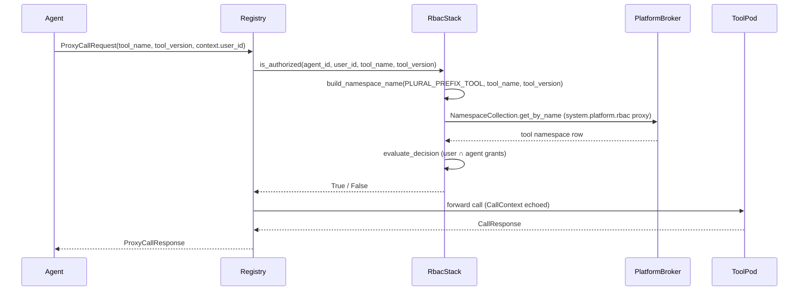

# 3tears Registry

MCP-compatible tool registry for the 3tears tool system. Routes tool calls between agents and tool pods via NATS request/reply.

Part of the [3tears](https://github.com/pacepace/3tears) framework.

## Components

- **`ToolCatalog`** -- in-memory index of registered tool pods, backed by a NATS KV bucket for recovery across restarts.
- **`RegistrationHandler`** -- subscribes to `{ns}.tools.register` and mutates the catalog.
- **`HeartbeatMonitor`** -- sweeps pods whose heartbeats fell behind the timeout and evicts their endpoints.
- **`DiscoveryHandler`** -- serves `{ns}.tools.discover` for pod-readiness polling.
- **`CallProxy`** -- the hot path. Subscribes to `{ns}.tools.call`, authorizes via `AgentToolAuthorizer`, selects an endpoint via the configured `RoutingStrategy`, and forwards the call to the tool pod via NATS request/reply with identity + correlation carried through the `CallContext` envelope.
- **`RegistryRbacStack`** -- self-contained rbac surface the standalone server constructs against the connected NATS client: NATS-proxy `NamespaceCollection` + four rbac metadata Collections + `AclCache` + invalidation subscribers. The `_run_server()` entry point uses this to wire `RbacEvaluatorAuthorizer` without any host-application loaders, so a standalone server no longer defaults to deny-all.

## Authorization

Tool dispatch authorization lives behind the `AgentToolAuthorizer` protocol. Implementations receive the calling agent id, the invoking user id (from `CallContext.user_id`), and the fully qualified tool name, and return a boolean decision.

Production deployments wire `RbacEvaluatorAuthorizer` (in `threetears.registry.rbac_authorizer`) which delegates to the unified rbac evaluator from `threetears.agent.acl`:

- The platform-side `ToolNamespaceEmitter` listens on `{ns}.tools.register` and upserts a `platform.namespaces` row of type `tool` per tool in every `RegistrationManifest`. The canonical `name` shape is `tools.<sanitized-mcp-name>.<sanitized-version>` (per `build_namespace_name`); `metadata` carries the pre-sanitized natural-identity fields `mcp_name` / `mcp_version` / `pod_id` so downstream pattern matching (the access materializer's agent.yaml `access.tools` patterns) does not need to reverse the sanitization rules.
- The authorizer resolves the tool namespace via an injected `NamespaceCollection`. The signature is `is_authorized(agent_id, user_id, tool_name, tool_version)`. The implementation builds the canonical lookup key via `build_namespace_name(PLURAL_PREFIX_TOOL, tool_name, tool_version)` rather than passing the raw `mcp_name` directly, so the lookup matches the row the emitter wrote.
- `evaluate_decision` resolves the two-sided grant chain: user side (groups the invoking user is in) intersected with agent side (groups the calling agent is in, short-circuited by namespace ownership). The decision is cached in `threetears.agent.acl.AclCache` with TTL + fine-grained invalidation; cross-process rbac mutations purge the cache promptly via the `acl.{membership,assignment,role}.invalidate` subjects the `RegistryRbacStack` subscribes to on startup.

Defense in depth: when `user_id=None` (tool dispatch without user identity) the authorizer denies unconditionally. When the namespace Collection's `get_by_name` returns `None` (tool registered but namespace row not yet visible) it denies. This catches registration races rather than defaulting to allow.

Platform-built-in tools land with `owner_agent_id=NULL, customer_id=NULL`. There is no implicit "anyone can call" behaviour for them. Grants are managed via explicit assignments on the platform-seeded `ToolCaller` role (same pattern as shared-type workspaces).

`RbacEvaluatorAuthorizer` is the only authorizer the production server wires: no dual-enforcement window, no back-compat aliases. The declarative `access.tools` expression on `agent.yaml` stays as operator-facing syntax and is translated to RBAC assignments at bootstrap.

## Dev-mode authorizers

`AllowAllAuthorizer` permits every dispatch unconditionally, enabled by `FOURTEENAIBOTS_REGISTRY_ALLOW_ALL_TOOLS=true`. Use only in local dev containers when an explicit RBAC bypass is needed.

`DenyAllAuthorizer` refuses every dispatch. Available as a panic-button kill switch via `FOURTEENAIBOTS_REGISTRY_FORCE_DENY_ALL=true`. It is also the millisecond-window placeholder the server holds *before* the rbac stack is wired against the live NATS client during `serve()`.

## Standalone entry point

```bash
python -m threetears.registry
```

Reads `THREETEARS_NATS_URL` (defaults to `nats://localhost:4222`) and `FOURTEENAIBOTS_NATS_SUBJECT_NAMESPACE` (the NATS subject namespace).

By default the entry point wires `RbacEvaluatorAuthorizer` against a self-contained `RegistryRbacStack` (NATS-proxy `NamespaceCollection` + four rbac metadata Collections + `AclCache` + invalidation subscribers). The proxy collections read through the platform broker's `system.platform.rbac` carve-out, so no direct DB credentials are needed. The registry is self-sufficient in any deployment with a reachable platform broker. Optional knobs:

- `FOURTEENAIBOTS_REGISTRY_ALLOW_ALL_TOOLS=true` -- bypass the rbac stack entirely (dev only).
- `FOURTEENAIBOTS_REGISTRY_FORCE_DENY_ALL=true` -- kill switch for misconfigured deployments.
- `THREETEARS_REGISTRY_ACL_TTL_SECONDS` -- override the AclCache TTL (default 60s).

Dispatch flow:


