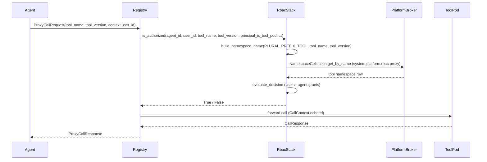

# 3tears Registry

MCP-compatible tool registry for the 3tears tool system. Routes tool calls between agents and tool pods via NATS request/reply.

Part of the [3tears](https://github.com/pacepace/3tears) framework.

## Components

- **`ToolCatalog`** -- in-memory index of registered tool pods, backed by a NATS KV bucket for recovery across restarts. Each pod's copy of a tool keeps the definition that pod announced.
- **`RegistrationHandler`** -- subscribes to `{ns}.tools.register`, verifies who published each manifest, admits each tool copy by copy, and replies naming every refused tool.
- **`HeartbeatMonitor`** -- sweeps pods whose heartbeats fell behind the timeout and evicts their endpoints.
- **`DiscoveryHandler`** -- serves `{ns}.tools.discover` for pod-readiness polling.
- **`CallProxy`** -- the hot path. Subscribes to `{ns}.tools.call`, authorizes via `AgentToolAuthorizer`, selects an endpoint via the configured `RoutingStrategy`, and forwards the call to the tool pod via NATS request/reply with identity + correlation carried through the `CallContext` envelope.
- **`RegistryRbacStack`** -- self-contained rbac surface the standalone server constructs against the connected NATS client: NATS-proxy `NamespaceCollection` + four rbac metadata Collections + `AclCache` + invalidation subscribers. The `_run_server()` entry point uses this to wire `RbacEvaluatorAuthorizer` without any host-application loaders, so a standalone server no longer defaults to deny-all.

## Registration: copies and publishers

One `name@version` may be served by many pods. Each pod's endpoint is a COPY carrying the definition that pod announced (`ToolDefinition`: description, schemas, timeout, confirmation gate). `CatalogEntry.select_copies(caller_id, schema_digest=None)` is the one function discovery and the call proxy use to decide what a caller sees and where its call goes: the caller's available copies with a live definition, the confirmation gate OR'd across all of them, the caller's own in-process copies ahead of shared ones, the most recently announced definition shown, and only copies serving that input schema routed to.

Who may register a copy is decided from verified identity (`ToolPodAuthenticator`), never from the manifest:

- a single-token pod id is a Tool Pod's; its token must pass `verify_pod` and name that same pod. Its copies serve every caller, so under a provider node it must own the node, and under none it must be the platform (`ToolPodAuth.platform_shared`, set by the host);
- a dotted `{agent}.{instance}` pod id is an agent's in-process server; its token must pass `verify_agent` and name that agent. Its copies serve only that agent. In 0.55.0 an unsigned one is still admitted, for its own agent only;
- a refusal is named in `RegistrationResponse.refused_tools` with a `RefusalCode`. A pod's `ToolServer` raises `ToolRegistrationRefused` from `wait_until_ready` for a final code (`threetears.agent.tools.server.FINAL_REFUSAL_CODES`); any other refusal, including `OWNERSHIP_GRAPH_UNAVAILABLE`, `UNVERIFIED_PUBLISHER`, `PUBLISHER_VERIFICATION_UNAVAILABLE`, `CATALOG_UNAVAILABLE` and a failed reply with no code, is waited out while the pod's heartbeat re-offers its manifest.
- a host failure is answered, never dropped. When the authenticator raises (its store could not be read) the manifest is refused with `PUBLISHER_VERIFICATION_UNAVAILABLE`; when the catalog write fails, with `CATALOG_UNAVAILABLE`. On the call path, an authorizer that raises answers `TOOL_AUTHORIZATION_UNAVAILABLE`, a replay ledger that raises answers `TOOL_POP_LEDGER_UNAVAILABLE`, and a pod answer that does not parse answers `TOOL_RESPONSE_MALFORMED`. Each is logged once at ERROR on the registry with its cause.

With no authenticator the registry runs in open mode: nothing is enforced, and it says so once at startup.

## Authorization

Tool dispatch authorization lives behind the `AgentToolAuthorizer` protocol. Implementations receive the calling principal id, the invoking user id (from `CallContext.user_id`), the fully qualified tool name and version, and one fact the ids cannot carry, `principal_is_tool_pod`, and return a boolean decision.

Production deployments wire `RbacEvaluatorAuthorizer` (in `threetears.registry.rbac_authorizer`) which delegates to the unified rbac evaluator from `threetears.agent.acl`:

- The platform-side `ToolNamespaceEmitter` listens on `{ns}.tools.register` and upserts a `namespaces` row of type `tool` per tool in every `RegistrationManifest`. The canonical `name` shape is `tools.<sanitized-mcp-name>.<sanitized-version>` (per `build_namespace_name`); `metadata` carries the pre-sanitized natural-identity fields `mcp_name` / `mcp_version` / `pod_id` so downstream pattern matching (the access materializer's agent.yaml `access.tools` patterns) does not need to reverse the sanitization rules.
- The authorizer resolves the tool namespace via an injected `NamespaceCollection`. The signature is `is_authorized(agent_id, user_id, tool_name, tool_version, *, principal_is_tool_pod)`. The implementation builds the canonical lookup key via `build_namespace_name(PLURAL_PREFIX_TOOL, tool_name, tool_version)` rather than passing the raw `mcp_name` directly, so the lookup matches the row the emitter wrote.
- `evaluate_decision` resolves the two-sided grant chain: user side (groups the invoking user is in) intersected with agent side (groups the calling agent is in, short-circuited by namespace ownership). The decision is cached in `threetears.agent.acl.AclCache`, which the `RegistryRbacStack` follows on the access tables' write generations at startup: a write evicts exactly the entries it reaches, and nothing in the cache ages.

Defense in depth: when `user_id=None` on an AGENT's dispatch the authorizer denies unconditionally, because an agent's tool grants are two-sided. When the namespace Collection's `get_by_name` returns `None` (tool registered but namespace row not yet visible) it denies. This catches registration races rather than defaulting to allow.

A TOOL POD is the one principal evaluated on its own grant alone. A pod acts on nobody's behalf and never carries a user; the hub mints its identity token with the platform customer sentinel (`threetears.core.security.PLATFORM_CUSTOMER_SENTINEL`) where a customer UUID would be, and `CallProxy._verify_identity` reads that signed claim as `customer_id=None` plus the mark it passes to the authorizer. `RbacEvaluatorAuthorizer` then evaluates the agent side only, against the pod's own group, exactly as the L3 broker and the hub's datasource authorizer evaluate the same principal. The mark buys evaluation and never authority: a marked pod holding no `ToolCaller` row on the tool's namespace is refused. Any non-UUID customer claim that is not the sentinel still fails closed at the door.

## Calling a tool from a tool pod

`ToolCallClient` (in `threetears.registry.client`) is the pod's half of the wire: it publishes the registry's own `ProxyCallRequest` on `{ns}.tools.call` with the pod's hub-minted identity token read from a provider on every call and a proof of possession minted by a caller-supplied signer (`PopSignerProtocol`, the shape the SDK's `PopSigner` has), and returns the `ProxyCallResponse` or raises `ToolCallError` carrying the registry's or the tool's refusal code. It is synchronous on the pod's own inbox and requests no durable reply; its default deadline sits above the registry's forward budget so a slow tool comes back as the registry's `TOOL_TIMEOUT` rather than the client's own transport fault.

Platform-built-in tools land with `owner_agent_id=NULL, customer_id=NULL`. There is no implicit "anyone can call" behaviour for them. Grants are managed via explicit assignments on the platform-seeded `ToolCaller` role (same pattern as shared-type workspaces).

`RbacEvaluatorAuthorizer` is the only authorizer the production server wires: no dual-enforcement window, no back-compat aliases. The declarative `access.tools` expression on `agent.yaml` stays as operator-facing syntax and is translated to RBAC assignments at bootstrap.

## Dev-mode authorizers

`AllowAllAuthorizer` permits every dispatch unconditionally, enabled by `THREETEARS_REGISTRY_ALLOW_ALL_TOOLS=true`. Use only in local dev containers when an explicit RBAC bypass is needed.

`DenyAllAuthorizer` refuses every dispatch. Available as a panic-button kill switch via `THREETEARS_REGISTRY_FORCE_DENY_ALL=true`. It is also the millisecond-window placeholder the server holds *before* the rbac stack is wired against the live NATS client during `serve()`.

## Standalone entry point

```bash
python -m threetears.registry
```

Reads `THREETEARS_NATS_URL` (defaults to `nats://localhost:4222`) and `THREETEARS_NATS_SUBJECT_NAMESPACE` (the NATS subject namespace).

By default the entry point wires `RbacEvaluatorAuthorizer` against a self-contained `RegistryRbacStack` (NATS-proxy `NamespaceCollection` + four rbac metadata Collections + `AclCache` + invalidation subscribers). The proxy collections read through the platform broker's `system.platform.rbac` carve-out, so no direct DB credentials are needed. Optional knobs:

- `THREETEARS_REGISTRY_ALLOW_ALL_TOOLS=true` -- bypass the rbac stack entirely (dev only).
- `THREETEARS_REGISTRY_FORCE_DENY_ALL=true` -- kill switch for misconfigured deployments.

### The registry's identity, which is REQUIRED

The broker resolves the caller of an L3 request from a **signed identity token** and refuses a request carrying none, so the registry must be able to prove who it is. `build_registry_rbac_stack` therefore takes an `identity_token` provider and raises `RegistryIdentityUnavailableError` without one -- at WIRING, not on the first query, because a backend built without a token looks built and then fails every read from wherever happens to touch L3 first.

3tears defines no handshake protocol (the subject, the payload, the principal store and the verifier are all the host's), so the provider is supplied out-of-band, exactly like the three factories below it:

- `THREETEARS_REGISTRY_IDENTITY_TOKEN_PROVIDER_FACTORY` -- a `module:callable` dotted path to an async factory `Callable[[NatsClient], Awaitable[RegistryIdentity]]`. `RegistryServer.serve` awaits it ONCE when the connection is up, before every other factory, and `RegistryServer.shutdown` awaits its `close()` after everything that reads through it has stopped and before the connection drains -- so the host's refresh loop stops with the process. The rbac, pod-authenticator and limit-guard factories are then called as `(nc, identity_token)`, each with the SAME identity's bound `token` method (`None` when no factory is configured): one handshake per process is the server's property, not host module state. The factories receive a **provider**, not a token: the token is short-lived and re-minted in place, and a captured value is expired within the hour.
- `THREETEARS_REGISTRY_IDENTITY_SIGNING_KEY_REF` -- the `scheme://locator` reference to the registry's own Ed25519 private key, default `env://THREETEARS_REGISTRY_IDENTITY_SIGNING_KEY`. 3tears only names the knob; the host's factory resolves it, because only the host knows what to do with it.

Unlike the other three hooks this one has no weaker-but-working default. Unset means the stack refuses to build, because a broker that refuses an unidentified request leaves nothing to fall back to.

Dispatch flow:


```mermaid
sequenceDiagram
    participant Agent
    participant Registry
    participant RbacStack
    participant PlatformBroker
    participant ToolPod

    Agent->>Registry: ProxyCallRequest(tool_name, tool_version, context.user_id)
    Registry->>RbacStack: is_authorized(agent_id, user_id, tool_name, tool_version, principal_is_tool_pod=...)
    RbacStack->>RbacStack: build_namespace_name(PLURAL_PREFIX_TOOL, tool_name, tool_version)
    RbacStack->>PlatformBroker: NamespaceCollection.get_by_name (system.platform.rbac proxy)
    PlatformBroker-->>RbacStack: tool namespace row
    RbacStack->>RbacStack: evaluate_decision (user ∩ agent grants)
    RbacStack-->>Registry: True / False
    Registry->>ToolPod: forward call (CallContext echoed)
    ToolPod-->>Registry: CallResponse
    Registry-->>Agent: ProxyCallResponse
```
