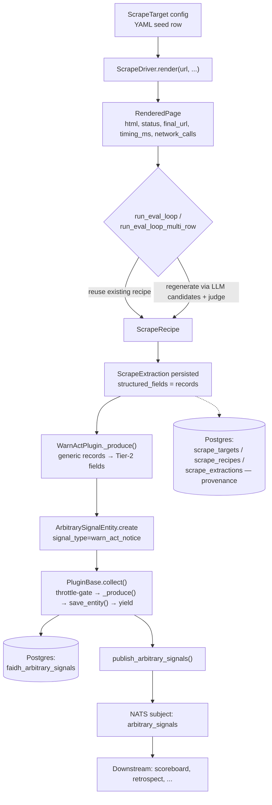
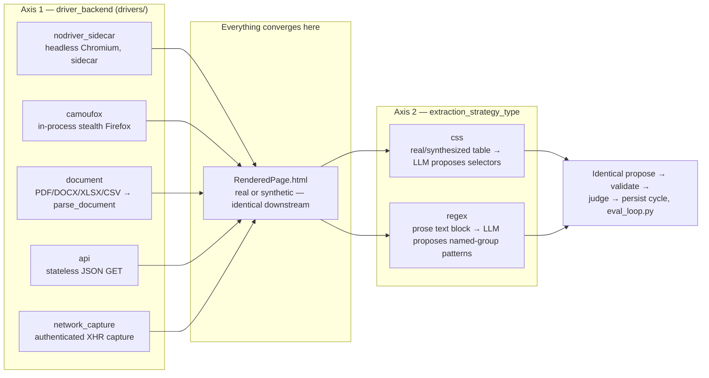
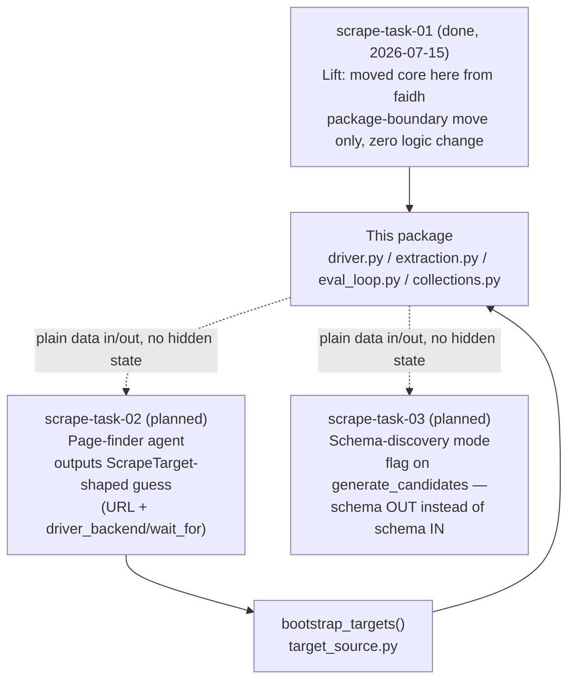

# 3tears-scrape

AI-driven, self-healing web scraping. Onboarding a new site is a config addition (a `ScrapeTarget` row), never a hand-written parser: an LLM proposes extraction candidates, each is structurally validated against the real page, an LLM judge picks the winner by comparing candidate values against real page content, and the winning strategy is persisted as a recipe reused on every later fetch until it stops working.

```bash
pip install 3tears-scrape
```

## What you get

- **`ScrapeDriver`** -- a pluggable, backend-agnostic render contract (`RenderedPage`, `NavStep`, `NetworkCall`). Five implementations ship: `NodriverSidecarDriver` (real headless Chromium via an isolated HTTP sidecar -- see `sidecar/`), `CamoufoxDriver` (in-process stealth Firefox, no sidecar needed), `DocumentDriver` (PDF/DOCX/XLSX/CSV/TXT/MD/LaTeX via `3tears-agent-tools`' `parse_document`), `ApiDriver` (stateless JSON API GET), and `NetworkCaptureDriver` (authenticated in-session XHR capture for pages whose real data never reaches a statelessly-fetchable API).
- **Two extraction-strategy shapes** -- CSS-selector candidates for real (or synthesized) HTML tables, and regex candidates for text-block/prose pages with no table structure at all. Both run through the identical propose -> structurally-validate -> judge -> persist cycle; the judge only ever sees extracted values and real page content, never which mechanism produced them.
- **`run_eval_loop` / `run_eval_loop_multi_row`** -- the self-healing cycle itself: reuse a target's existing `ScrapeRecipe` with zero LLM calls while it keeps validating; only regenerate candidates once `consecutive_validation_failures` crosses a threshold.
- **`ScrapeTarget` / `ScrapeRecipe` / `ScrapeExtraction`** -- the domain-agnostic persisted entities (three-tier L1/L2/L3-backed collections). The core never learns what a field *means* -- only that whatever a candidate extracts for a caller-supplied field name parses as its declared type.
- **Pluggable target config** -- `TargetSource` (`StaticTargetSource` / `YamlTargetSource` / `CollectionTargetSource`) and `bootstrap_targets()` for seeding a database-backed target collection from a git-tracked YAML file, never overwriting a row already present.
- **`ScrapeTool`** -- an ad-hoc, single-call MCP-exposed entry point: give it a URL and a field schema, get back real extracted data through the same eval loop, no target pre-configuration required.
- **`enrichment.py`** -- a secondary, separate LLM pass capturing free-form context a structured schema has no field for, kept distinct from validated structured data.

## Quickstart

```python
from threetears.scrape.drivers.nodriver_sidecar import NodriverSidecarDriver
from threetears.scrape.eval_loop import run_eval_loop_multi_row
from threetears.scrape.collections import ScrapeRecipeCollection, ScrapeExtractionCollection

driver = NodriverSidecarDriver("http://localhost:8088")
page = await driver.render("https://example.gov/warn-notices")

extraction = await run_eval_loop_multi_row(
    "example_warn_notices", page.html, page.final_url,
    schema={"employer": str, "county": str, "affected_count": int},
    recipe_collection=ScrapeRecipeCollection(registry, config),
    extraction_collection=ScrapeExtractionCollection(registry, config),
    api_key=openrouter_api_key,
)
print(extraction.validation_status, extraction.structured_fields["records"])
```

## The nodriver sidecar

`NodriverSidecarDriver` talks HTTP to a genuinely separate process/container -- this is the AGPL isolation boundary nodriver (AGPL-3.0) requires, since this package itself is MIT-licensed. Build and run it via `docker buildx bake nodriver-sidecar` from the repo root; see `sidecar/README.md` for details. If you don't want the sidecar dependency at all, `CamoufoxDriver` is a fully in-process, MPL-2.0-safe alternative.

## Architecture

> Lifted from faidh's `src/faidh/scrape/` into this package (`scrape-task-01`, 2026-07-15) as a directory move -- zero logic changes. faidh's WARN Act plugin is used throughout as the running example of a consumer; it remains a faidh-side module (`faidh/src/faidh/intake/plugins/warn_act.py`), not part of this package, and is the only place WARN-domain meaning exists.

### Why this exists

WARN Act notices are published by ~24 US state labor departments in wildly inconsistent formats -- real HTML tables, PDF/DOCX/XLSX filings, prose text blocks, JSON APIs, and at least one state gated behind an authenticated search form with no stable URLs. The naive answer is "write a scraper per state." That's 24+ bespoke, brittle, un-composable parsers that all rot independently.

The actual answer: **two orthogonal, config-selected axes** -- how to *fetch* a page and how to *extract* from it -- cover every state as a combination of the two, with zero jurisdiction-specific code in the core.

### 1. Data flow: source → Postgres (faidh's WARN Act consumer, as an example)



Two Postgres-writing paths run **in parallel, not sequentially**:

- **Provenance** (`scrape_targets`, `scrape_recipes`, `scrape_extractions`) -- what was fetched, what strategy won, when. Domain-agnostic, lives in this package.
- **Signal** (`faidh_arbitrary_signals`) -- what faidh's forecasting actually reads. Faidh-specific, mapped by `WarnActPlugin._produce()`, stays in faidh.

### 2. The abstraction: `ScrapeTarget` is the entire adapter surface

Zero jurisdiction-specific Python exists anywhere in this package. In faidh's WARN Act consumer, every state is a `ScrapeTarget` row (`faidh/src/faidh/intake/plugins/seeds/warn_act_targets.yaml`), bootstrapped into the DB.

| Field | Controls |
|---|---|
| `url` | what to fetch |
| `driver_backend` | which of 5 `ScrapeDriver` implementations renders it |
| `wait_for` | CSS selector to settle on (async-loading pages) |
| `nav_steps` | ordered click/fill/wait_for/wait_ms actions (search-form-gated pages) |
| `timeout_seconds` | per-target render budget |
| `field_schema` | field name → Python type, e.g. `{"employer": str, "county": str}` |
| `extraction_strategy_type` | `"css"` or `"regex"` |
| `api_results_path` / `api_fragment_field` | JSON traversal (API driver only) |
| `multi_row` | one record vs. many per page |

The core (`driver.py`, `extraction.py`, `eval_loop.py`, `collections.py`) never branches on target identity -- only on `ScrapeTarget` fields and a caller-supplied `field_schema`. It doesn't know what `employer` *means*; it only enforces that whatever a candidate extracts for that field name parses as the declared type. Stated in `extraction.py`'s own docstring: *"this module never hardcodes what a field means."*

### 3. Fetch × Extract = many combinations, not one scraper per site



In faidh's WARN Act consumer, every one of the ~24 onboarded states is one config row picking a combination from this matrix. A new driver/strategy is only written when a target needs a *fetch mechanism* or *extraction shape* that doesn't exist yet -- five times across the WARN Act build: regex strategy, `ApiDriver`, native CSV support, `NetworkCaptureDriver`, plus the original CSS/nodriver baseline.

### 4. "The signal must carry the value; the model must never infer it" -- where the rule actually lives

| Checkpoint | Mechanism | Proof (faidh's WARN Act consumer) |
|---|---|---|
| Structural validation, all-or-nothing per record | `validate_candidate` / `validate_row_candidate` (+ regex variants), `extraction.py` -- no coercion, no defaults, a record missing even one requested field is **dropped entirely** | Oklahoma: 217 real records exist, only 128 survived -- the other 89 genuinely lack a workforce-region value on the page |
| Schema omits what a page can't provide | `field_schema` per target -- never forces a value that isn't there | New York schema doesn't request `affected_count`/`effective_date` because its page has neither |
| Judge does semantic verification, not just structural plausibility | `_judge_candidates` / `_judge_row_candidates`, `eval_loop.py` -- sees real page HTML + candidate values, told structural validity is already checked, job is *semantic correctness* | Georgia: an earlier schema mistakenly asked for `county`; judge rejected the resulting hallucinated-mapping candidate rather than accepting it |
| Confirmed vs. best-guess survives to the signal | `ScrapeExtraction.validation_status` ∈ `validated` / `needs_review` / `failed` | `WarnActPlugin._produce()` logs a distinct warning for `needs_review` yields rather than treating them as confirmed |

**Open tension, not fully resolved:** a `needs_review` record still gets yielded as a real signal -- "surface for review, never silently drop" beats "silently withhold," by deliberate design. But nothing downstream currently filters on `validation_status`. The signal *carries* the distinction; no consumer currently *reads* it. A consumer treating every signal as equally trustworthy today would be wrong to.

### 5. Where new capabilities plug in



`task-02`/`task-03` are new front-end stages that will produce/consume the same plain data shapes (`RenderedPage`, `FieldSchema`, `ScrapeExtraction`) the core already uses -- neither requires touching `driver.py`, `eval_loop.py`, or `collections.py`.

### 6. Module map

```
packages/scrape/src/threetears/scrape/
├── driver.py                 ScrapeDriver ABC, RenderedPage, NavStep, NetworkCall
├── drivers/
│   ├── nodriver_sidecar.py   HTTP → headless Chromium sidecar (AGPL boundary)
│   ├── camoufox.py           in-process stealth Firefox (MPL-2.0-safe)
│   ├── document.py           parse_document() + document_text_to_html()
│   ├── api.py                stateless JSON GET, _resolve_path()
│   └── network_capture.py    wraps another driver, _find_largest_record_list()
├── extraction.py             generate_candidates/generate_row_candidates (+ regex),
│                              validate_candidate/validate_row_candidate (+ regex),
│                              html_to_text(), strip_boilerplate()
├── eval_loop.py               run_eval_loop()/run_eval_loop_multi_row(),
│                              _judge_candidates()/_judge_row_candidates(),
│                              _persist_extraction(), _save_recipe()
├── collections.py             ScrapeTarget/ScrapeRecipe/ScrapeExtraction (BaseEntity)
│                              + BaseCollection subclasses (L1/L2/L3 via
│                              threetears.core.backends.protocol.DurableStore)
├── migrations.py               v001-v008, PACKAGE_NAME="3tears_scrape"
├── target_source.py            TargetSource ABC, YamlTargetSource, CollectionTargetSource,
│                              StaticTargetSource, bootstrap_targets()
├── tool.py                     ScrapeTool — ad-hoc single-call MCP entry point
├── enrichment.py                secondary free-form LLM notes pass (separate from structured_fields)
└── llm_retry.py                 bounded_retry_structured_call() — shared by extraction.py + eval_loop.py

Example consumer (faidh repo, not part of this package):
faidh/src/faidh/intake/plugins/warn_act.py               WarnActPlugin — the ONLY place WARN-domain meaning exists
faidh/src/faidh/intake/plugins/seeds/warn_act_targets.yaml   the ScrapeTarget config rows
faidh/src/faidh/intake/runner.py                          publish_observations(), publish_arbitrary_signals(), poll_scrape_targets()
faidh/src/faidh/intake/plugins/__init__.py                PluginBase.collect() — persist-then-yield template method
faidh/src/faidh/intake/signals/arbitrary.py               ArbitrarySignalEntity/Collection — the actual Postgres sink
```

**Call chain, one live poll cycle (faidh's WARN Act consumer):** `runner.publish_observations()` → `WarnActPlugin.collect()` (inherited `PluginBase`) → `WarnActPlugin._produce()` → resolves `self._drivers[target.driver_backend]` → `driver.render(...)` → `run_eval_loop_multi_row(...)` (or `run_eval_loop` if `multi_row=False`) → `_reuse_row_recipe`/`_regenerate_row_recipe` (or `_regex_` variants) → `_persist_extraction()` writes `scrape_extractions` → back in `_produce()`, each record becomes an `ArbitrarySignalEntity` → `collect()`'s `save_entity()` writes `faidh_arbitrary_signals` → `publish_arbitrary_signals()` re-drives `collect()` and publishes each yielded entity to `arbitrary_signals()` on NATS.

## License

MIT. See [LICENSE](LICENSE). The bundled sidecar (`sidecar/`) wraps nodriver (AGPL-3.0) as a genuinely separate process -- see `sidecar/README.md`.
