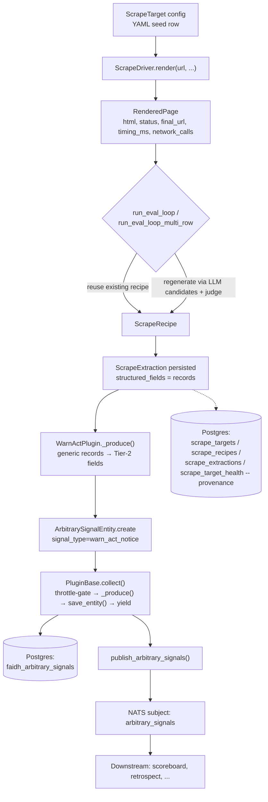
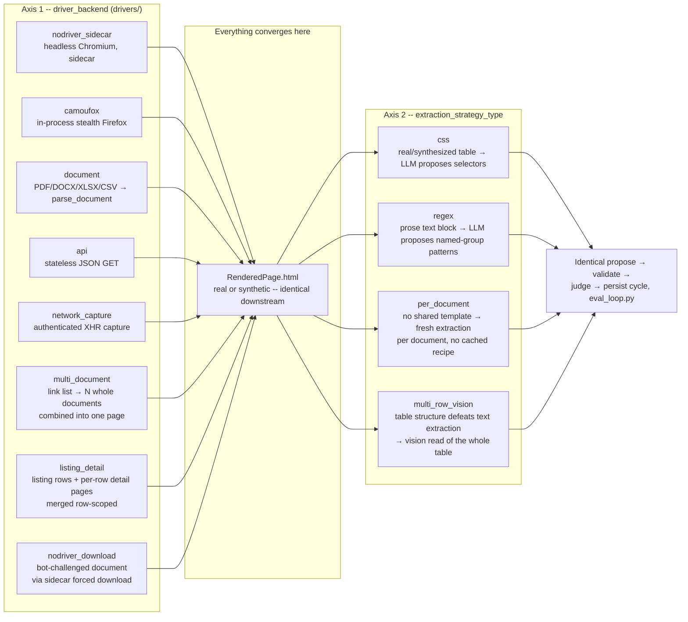
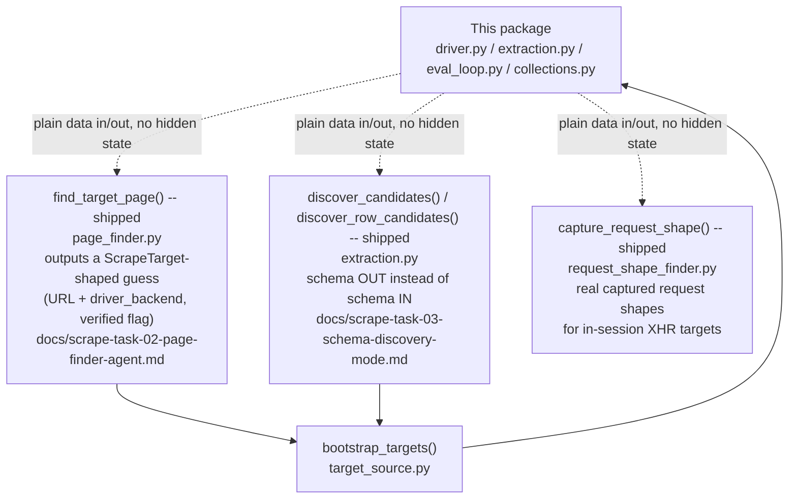

# 3tears-scrape

AI-driven, self-healing web scraping. Onboarding a new site is a config addition (a `ScrapeTarget` row), never a hand-written parser: an LLM proposes extraction candidates, each is structurally validated against the real page, an LLM judge picks the winner by comparing candidate values against real page content, and the winning strategy is persisted as a recipe reused on every later fetch until it stops working.

```bash
pip install 3tears-scrape
```

## What you get

- **`ScrapeDriver`** -- a pluggable, backend-agnostic render contract (`RenderedPage`, `NavStep`, `NetworkCall`). Eight implementations ship: `NodriverSidecarDriver` (real headless Chromium via an isolated HTTP sidecar -- see `sidecar/`), `CamoufoxDriver` (in-process stealth Firefox, no sidecar needed), `DocumentDriver` (PDF/DOCX/XLSX/CSV/TXT/MD/LaTeX via `3tears-agent-tools`' `parse_document`), `ApiDriver` (stateless JSON API GET), `NetworkCaptureDriver` (authenticated in-session XHR capture for pages whose real data never reaches a statelessly-fetchable API), `MultiDocumentDriver` (a listing of links that each point at one whole document rather than a row, fetched via an injected inner driver and concatenated into one combined page, skipping documents already seen on a prior poll), `ListingDetailDriver` (a listing table whose rows each link to a per-record detail page, resolved row-scoped and merged back into one flat synthetic table -- detail value preferred, listing value as fallback, neither fabricated), and `NodriverDownloadDriver` (a document behind a real bot challenge a plain HTTP client can't pass, fetched through the sidecar's forced-download endpoint).
- **Four extraction-strategy shapes** (`eval_loop.StrategyType`) -- `css` selector candidates for real (or synthesized) HTML tables; `regex` candidates for text-block/prose pages with no table structure at all; `per_document` for independently-worded documents that share no template a single cached pattern could ever generalize across, which get a fresh extraction call each instead of a reused recipe; and `multi_row_vision` for a table whose own structure defeats text-based table extraction and needs the whole table read visually at once. All four run through the identical propose -> structurally-validate -> judge -> persist cycle; the judge only ever sees extracted values and real page content, never which mechanism produced them. Chosen explicitly per target, never auto-detected -- two superficially identical page shapes have needed opposite strategies.
- **`run_eval_loop` / `run_eval_loop_multi_row`** -- the self-healing cycle itself: reuse a target's existing `ScrapeRecipe` with zero LLM calls while it keeps validating; regenerate candidates once `consecutive_validation_failures` crosses a threshold, or immediately when a failure is classified as the page having genuinely changed (see `challenge.py`), since waiting two more polls for evidence already in hand is pure latency.
- **`ScrapeTarget` / `ScrapeRecipe` / `ScrapeExtraction` / `ScrapeTargetHealth`** -- the domain-agnostic persisted entities (three-tier L1/L2/L3-backed collections). `ScrapeTargetHealth` is per-target FETCH health, deliberately separate from the recipe: it exists for targets that never had a recipe at all, such as one walled off before it ever extracted successfully. The core never learns what a field *means* -- only that whatever a candidate extracts for a caller-supplied field name parses as its declared type.
- **Pluggable target config** -- `TargetSource` (`StaticTargetSource` / `YamlTargetSource` / `CollectionTargetSource`) and `bootstrap_targets()` for seeding a database-backed target collection from a git-tracked YAML file, never overwriting a row already present.
- **`ScrapeTool`** -- an ad-hoc, single-call MCP-exposed entry point: give it a URL and a field schema, get back real extracted data through the same eval loop, no target pre-configuration required.
- **`enrichment.py`** -- a secondary, separate LLM pass capturing free-form context a structured schema has no field for, kept distinct from validated structured data.
- **`parse_form()` / `build_form_post()`** -- deterministic, browser-free HTML form parsing and postback serialization: reduce a form to its POST target, its default "successful controls", and its submit controls, then serialize a replayable body. For the many server-rendered portals (the classic case being ASP.NET WebForms' `__VIEWSTATE`/`__EVENTVALIDATION`) that only return rows after a form POST, this replaces driving a browser with a plain HTTP round-trip. Pure and side-effect-free -- no network, no LLM, no hardcoded framework or field meaning.
- **`find_target_page()`** -- a bounded-turn research agent: give it a plain-language query ("Ohio WARN Act notices"), it searches and fetches candidate pages (WebSearch/WebFetch, capped turns), deterministically verifies the winner has real extractable structure (a table, a document link, a JSON API response -- never a browser fetch, so it never needs the sidecar running), and returns a `PageFinderResult` (`url`, a `driver_backend` guess, `verified`). Independently callable -- it never persists a `ScrapeTarget` or forces extraction to follow; a caller with a known URL never needs this at all.
- **`discover_candidates()` / `discover_row_candidates()`** -- "capture every variable on this page": the inverse of `generate_candidates`/`generate_row_candidates`, no caller-supplied `field_schema` required. An LLM proposes field names/types/selectors it finds on the page, each validated by the exact same `validate_candidate`/`validate_row_candidate` every schema-driven candidate already goes through -- a discovered field that doesn't structurally validate is dropped, never included. Returns a `DiscoverySchemaResult` whose `field_schema`/`strategy` are already shaped exactly as `ScrapeTarget.field_schema`/`ScrapeRecipe.extraction_strategy` expect. Never persists anything -- a caller decides what to do with the result.
- **`capture_request_shape()`** -- the "how" sibling to `find_target_page()`'s "what": drive a real browser session at a target and report back every XHR/fetch call it actually made, so an authenticated in-session API's real request shape is *captured* rather than guessed from remembered conventions. Deliberately does not pick "the one real call" out of the results -- a target's real data call is reliably neither the largest nor the first, so it returns everything and the caller decides.

## Quickstart

```python
from threetears.scrape.drivers.nodriver_sidecar import NodriverSidecarDriver
from threetears.scrape.eval_loop import run_eval_loop_multi_row
from threetears.scrape.collections import ScrapeRecipeCollection, ScrapeExtractionCollection

driver = NodriverSidecarDriver("http://localhost:8088")
page = await driver.render("https://example.gov/warn-notices")

extraction = await run_eval_loop_multi_row(
    "example_warn_notices", page.html, page.final_url,
    schema={"employer": str, "county": str, "affected_count": int},
    recipe_collection=ScrapeRecipeCollection(registry, config),
    extraction_collection=ScrapeExtractionCollection(registry, config),
    api_key=openrouter_api_key,
)
print(extraction.validation_status, extraction.structured_fields["records"])
```

## The nodriver sidecar

`NodriverSidecarDriver` talks HTTP to a genuinely separate process/container -- this is the AGPL isolation boundary nodriver (AGPL-3.0) requires, since this package itself is MIT-licensed. Build and run it via `docker buildx bake nodriver-sidecar` from the repo root; the container definition, its pinned AGPL-3.0 licence, and its own contract tests all live in [`sidecar/`](sidecar/). If you don't want the sidecar dependency at all, `CamoufoxDriver` is a fully in-process, MPL-2.0-safe alternative.

## Architecture

> Lifted from faidh's `src/faidh/scrape/` into this package ([`docs/scrape-task-01-lift-core-package.md`](https://github.com/pacepace/3tears/blob/main/docs/scrape-task-01-lift-core-package.md), 2026-07-15) as a directory move -- zero logic changes. faidh's WARN Act plugin is used throughout as the running example of a consumer; it remains a faidh-side module (`faidh/src/faidh/intake/plugins/warn_act.py`), not part of this package, and is the only place WARN-domain meaning exists.

### Why this exists

WARN Act notices are published by ~24 US state labor departments in wildly inconsistent formats -- real HTML tables, PDF/DOCX/XLSX filings, prose text blocks, JSON APIs, and at least one state gated behind an authenticated search form with no stable URLs. The naive answer is "write a scraper per state." That's 24+ bespoke, brittle, un-composable parsers that all rot independently.

The actual answer: **two orthogonal, config-selected axes** -- how to *fetch* a page and how to *extract* from it -- cover every state as a combination of the two, with zero jurisdiction-specific code in the core.

### 1. Data flow: source → Postgres (faidh's WARN Act consumer, as an example)


```mermaid
flowchart TD
    A[ScrapeTarget config<br/>YAML seed row] --> B["ScrapeDriver.render(url, ...)"]
    B --> C[RenderedPage<br/>html, status, final_url, timing_ms, network_calls]
    C --> D{run_eval_loop /<br/>run_eval_loop_multi_row}
    D -->|reuse existing recipe| E[ScrapeRecipe]
    D -->|regenerate via LLM candidates + judge| E
    E --> F[ScrapeExtraction persisted<br/>structured_fields = records]
    F --> G["WarnActPlugin._produce()<br/>generic records → Tier-2 fields"]
    G --> H[ArbitrarySignalEntity.create<br/>signal_type=warn_act_notice]
    H --> I["PluginBase.collect()<br/>throttle-gate → _produce() → save_entity() → yield"]
    I --> J[(Postgres:<br/>faidh_arbitrary_signals)]
    I --> K["publish_arbitrary_signals()"]
    K --> L[NATS subject: arbitrary_signals]
    L --> M[Downstream: scoreboard, retrospect, ...]

    F -.-> N[(Postgres:<br/>scrape_targets / scrape_recipes /<br/>scrape_extractions / scrape_target_health -- provenance)]
```

Two Postgres-writing paths run **in parallel, not sequentially**:

- **Provenance** (`scrape_targets`, `scrape_recipes`, `scrape_extractions`, `scrape_target_health`) -- what was fetched, what strategy won, when, and whether the fetch itself is healthy. Domain-agnostic, lives in this package.
- **Signal** (`faidh_arbitrary_signals`) -- what faidh's forecasting actually reads. Faidh-specific, mapped by `WarnActPlugin._produce()`, stays in faidh.

### 2. The abstraction: `ScrapeTarget` is the entire adapter surface

Zero jurisdiction-specific Python exists anywhere in this package. In faidh's WARN Act consumer, every state is a `ScrapeTarget` row (`faidh/src/faidh/intake/plugins/seeds/warn_act_targets.yaml`), bootstrapped into the DB.

| Field | Controls |
|---|---|
| `url` | what to fetch |
| `driver_backend` | which of the 8 `ScrapeDriver` implementations renders it |
| `wait_for` | CSS selector to settle on (async-loading pages) |
| `nav_steps` | ordered click/fill/wait_for/wait_ms/scroll_into_view/scroll_page/evaluate actions (search-form-gated, lazy-render, or in-page-JS-state targets) |
| `timeout_seconds` | per-target render budget |
| `field_schema` | field name → Python type, e.g. `{"employer": str, "county": str}` |
| `extraction_strategy_type` | `"css"`, `"regex"`, `"per_document"`, or `"multi_row_vision"` |
| `api_results_path` / `api_fragment_field` | JSON traversal (`api` driver; also `multi_document`'s JSON discovery mode) |
| `link_selector` | CSS selector matching the document links on a listing page (`multi_document`'s HTML discovery mode) |
| `multi_row` | one record vs. many per page |

The core (`driver.py`, `extraction.py`, `eval_loop.py`, `collections.py`) never branches on target identity -- only on `ScrapeTarget` fields and a caller-supplied `field_schema`. It doesn't know what `employer` *means*; it only enforces that whatever a candidate extracts for that field name parses as the declared type. Stated in `extraction.py`'s own docstring: *"this module never hardcodes what a field means."*

### 3. Fetch × Extract = many combinations, not one scraper per site


```mermaid
flowchart LR
    subgraph Fetch["Axis 1 -- driver_backend (drivers/)"]
        D1[nodriver_sidecar<br/>headless Chromium, sidecar]
        D2[camoufox<br/>in-process stealth Firefox]
        D3[document<br/>PDF/DOCX/XLSX/CSV → parse_document]
        D4[api<br/>stateless JSON GET]
        D5[network_capture<br/>authenticated XHR capture]
        D6[multi_document<br/>link list → N whole documents<br/>combined into one page]
        D7[listing_detail<br/>listing rows + per-row detail pages<br/>merged row-scoped]
        D8[nodriver_download<br/>bot-challenged document<br/>via sidecar forced download]
    end
    subgraph Converge["Everything converges here"]
        R[RenderedPage.html<br/>real or synthetic -- identical downstream]
    end
    subgraph Extract["Axis 2 -- extraction_strategy_type"]
        S1[css<br/>real/synthesized table → LLM proposes selectors]
        S2[regex<br/>prose text block → LLM proposes named-group patterns]
        S3[per_document<br/>no shared template → fresh extraction<br/>per document, no cached recipe]
        S4[multi_row_vision<br/>table structure defeats text extraction<br/>→ vision read of the whole table]
    end
    D1 & D2 & D3 & D4 & D5 & D6 & D7 & D8 --> R
    R --> S1
    R --> S2
    R --> S3
    R --> S4
    S1 & S2 & S3 & S4 --> J[Identical propose → validate →<br/>judge → persist cycle, eval_loop.py]
```

In faidh's WARN Act consumer, every one of the ~24 onboarded states is one config row picking a combination from this matrix. A new driver/strategy is only written when a target needs a *fetch mechanism* or *extraction shape* that doesn't exist yet -- and each one that was written has a named real target behind it: the regex strategy (a prose listing with no table), `ApiDriver` (a JSON search endpoint), native CSV support, `NetworkCaptureDriver` (an authenticated Aura POST), `MultiDocumentDriver` plus `per_document` (one PDF letter per notice, no two worded alike), `NodriverDownloadDriver` (those PDFs behind a Cloudflare challenge), `multi_row_vision` (a born-digital PDF table that text extraction mis-split), and `ListingDetailDriver` (a listing whose records are genuinely split across two pages).

### 4. "The signal must carry the value; the model must never infer it" -- where the rule actually lives

| Checkpoint | Mechanism | Proof (faidh's WARN Act consumer) |
|---|---|---|
| Structural validation, all-or-nothing per record | `validate_candidate` / `validate_row_candidate` (+ regex variants), `extraction.py` -- no coercion, no defaults, a record missing even one requested field is **dropped entirely** | Oklahoma: 217 real records exist, only 128 survived -- the other 89 genuinely lack a workforce-region value on the page |
| Schema omits what a page can't provide | `field_schema` per target -- never forces a value that isn't there | New York schema doesn't request `affected_count`/`effective_date` because its page has neither |
| Judge does semantic verification, not just structural plausibility | `_judge_candidates` / `_judge_row_candidates`, `eval_loop.py` -- sees real page HTML + candidate values, told structural validity is already checked, job is *semantic correctness* | Georgia: an earlier schema mistakenly asked for `county`; judge rejected the resulting hallucinated-mapping candidate rather than accepting it |
| Confirmed vs. best-guess survives to the signal | `ScrapeExtraction.validation_status` ∈ `validated` / `needs_review` / `failed` / `blocked` | `WarnActPlugin._produce()` logs a distinct warning for `needs_review` yields rather than treating them as confirmed |
| "We never received the page" is not "the page was wrong" | `challenge.classify_failed_page`, `challenge.py` -- asked only once extraction has already failed, and only about a page that differs from the last one that worked; a `blocked` verdict persists `validation_status="blocked"` with no records and leaves the recipe untouched | A bot wall used to increment the same failure counter a redesign does, so three polls later the recipe was discarded and an LLM round spent learning to extract data from a challenge page |

One value appears in `ScrapeTool`'s JSON payload under the same key and is deliberately not a `ValidationStatus`: `backoff`, reported when the fetch circuit suppressed the poll. It is never stored, because a suppressed poll persists nothing -- the other four all describe a page we did or did not receive, where `backoff` describes a fetch we declined to attempt. A consumer that lumps it in with `blocked` will record a bot wall for a target that was merely being backed off, which is the exact conflation the circuit was built to stop.

**Open tension, not fully resolved:** a `needs_review` record still gets yielded as a real signal -- "surface for review, never silently drop" beats "silently withhold," by deliberate design. But nothing downstream currently filters on `validation_status`. The signal *carries* the distinction; no consumer currently *reads* it. A consumer treating every signal as equally trustworthy today would be wrong to. `blocked` widens that gap slightly: it is the one value that means *no data was produced and none should have been*, so a consumer that treats it as a failed extraction will over-count failures for a target that is merely walled.

### 5. Where new capabilities plug in


```mermaid
flowchart TD
    Core["This package<br/>driver.py / extraction.py / eval_loop.py / collections.py"]
    T02["find_target_page() -- shipped<br/>page_finder.py<br/>outputs a ScrapeTarget-shaped guess<br/>(URL + driver_backend, verified flag)<br/>docs/scrape-task-02-page-finder-agent.md"]
    T03["discover_candidates() / discover_row_candidates() -- shipped<br/>extraction.py<br/>schema OUT instead of schema IN<br/>docs/scrape-task-03-schema-discovery-mode.md"]
    T04["capture_request_shape() -- shipped<br/>request_shape_finder.py<br/>real captured request shapes<br/>for in-session XHR targets"]
    Core -.plain data in/out, no hidden state.-> T02
    Core -.plain data in/out, no hidden state.-> T03
    Core -.plain data in/out, no hidden state.-> T04
    T02 --> BT["bootstrap_targets()<br/>target_source.py"]
    T03 --> BT
    BT --> Core
```

All three front-end stages have shipped, and each landed without touching `driver.py`, `eval_loop.py`, or `collections.py` -- which is the point. They produce and consume the same plain data shapes (`RenderedPage`, `FieldSchema`, `PageFinderResult`, `DiscoverySchemaResult`) the core already uses, and none of them persists anything: a caller decides whether a discovered page or schema becomes a real `ScrapeTarget`.

Full designs live in `docs/`: [`scrape-lift-design.md`](https://github.com/pacepace/3tears/blob/main/docs/scrape-lift-design.md) (the overall shape and its decision log), [`scrape-task-01-lift-core-package.md`](https://github.com/pacepace/3tears/blob/main/docs/scrape-task-01-lift-core-package.md) (the lift itself and the AGPL isolation boundary), [`scrape-task-02-page-finder-agent.md`](https://github.com/pacepace/3tears/blob/main/docs/scrape-task-02-page-finder-agent.md), [`scrape-task-03-schema-discovery-mode.md`](https://github.com/pacepace/3tears/blob/main/docs/scrape-task-03-schema-discovery-mode.md), and [`scrape-task-04-multi-document-driver.md`](https://github.com/pacepace/3tears/blob/main/docs/scrape-task-04-multi-document-driver.md) (the multi-document driver plus the sidecar's browser-forced-download mode).

### 6. Module map

```
packages/scrape/src/threetears/scrape/
├── driver.py                 ScrapeDriver ABC, RenderedPage, NavStep, NetworkCall
├── drivers/
│   ├── nodriver_sidecar.py   HTTP → headless Chromium sidecar (AGPL boundary)
│   ├── camoufox.py           in-process stealth Firefox (MPL-2.0-safe)
│   ├── document.py           parse_document() + document_text_to_html()
│   ├── api.py                stateless JSON GET, _resolve_path()
│   ├── network_capture.py    wraps another driver, _find_largest_record_list()
│   ├── multi_document.py     link list → N documents → one combined page, seen_urls dedup
│   ├── listing_detail.py     listing rows + per-row detail pages, merged into one table
│   └── nodriver_download.py  sidecar POST /v1/download → parse_document_bytes_to_html()
├── extraction.py             generate_candidates/generate_row_candidates (+ regex),
│                              validate_candidate/validate_row_candidate (+ regex),
│                              html_to_text(), strip_boilerplate()
├── eval_loop.py               run_eval_loop()/run_eval_loop_multi_row(),
│                              _judge_candidates()/_judge_row_candidates(),
│                              _persist_extraction(), _save_recipe()
├── challenge.py               PageVerdict, classify_failed_page() -- asks what a page that
│                              failed extraction actually is; no vendor markers
├── health.py                  ScrapeTargetHealth + collection, content_fingerprint(),
│                              record_validated_fetch(), record_classification(),
│                              record_circuit_state(), record_robots_block(),
│                              list_walled() -- the only non-primary-key query here:
│                              which targets need a human, walls and robots blocks both
├── circuit.py                 TargetCircuit, BackoffPolicy -- gates the FETCH of a target
│                              that keeps coming back walled, so its fetch rate and its
│                              classification rate both decay. Transitions come from
│                              models.circuit_breaker.CircuitBreaker via restore()
├── session_state.py           seal_session_state()/open_session_state()/
│                              usable_session_state() -- a human's cleared browser state,
│                              sealed under an operator key, handed back to later
│                              unattended renders so one solve is not paid for twice
├── robots.py                  RobotsGate, RobotsPolicy -- waits a site's Crawl-delay and
│                              escalates a Disallow to a human. Both on by default
├── reprobe.py                 ScheduledJobsReprobeScheduler -- books the next probe as a
│                              scheduled-jobs relative_delay job. Needs the [reprobe] extra
├── collections.py             ScrapeTarget/ScrapeRecipe/ScrapeExtraction (BaseEntity)
│                              + BaseCollection subclasses (L1/L2/L3 via
│                              threetears.core.backends.protocol.DurableStore)
├── migrations.py               v001-v012, PACKAGE_NAME="3tears_scrape"
├── target_source.py            TargetSource ABC, YamlTargetSource, CollectionTargetSource,
│                              StaticTargetSource, bootstrap_targets()
├── page_finder.py              find_target_page() -- bounded-turn search/fetch research agent
├── request_shape_finder.py     capture_request_shape() -- real captured XHR/fetch shapes
├── forms.py                    parse_form()/build_form_post() -- browser-free postback replay
├── tool.py                     ScrapeTool -- ad-hoc single-call MCP entry point
├── enrichment.py                secondary free-form LLM notes pass (separate from structured_fields)
└── llm_retry.py                 bounded_retry_structured_call() -- shared by extraction.py + eval_loop.py

Example consumer (faidh repo, not part of this package):
faidh/src/faidh/intake/plugins/warn_act.py               WarnActPlugin -- the ONLY place WARN-domain meaning exists
faidh/src/faidh/intake/plugins/seeds/warn_act_targets.yaml   the ScrapeTarget config rows
faidh/src/faidh/intake/runner.py                          publish_observations(), publish_arbitrary_signals(), poll_scrape_targets()
faidh/src/faidh/intake/plugins/__init__.py                PluginBase.collect() -- persist-then-yield template method
faidh/src/faidh/intake/signals/arbitrary.py               ArbitrarySignalEntity/Collection -- the actual Postgres sink
```

**Call chain, one live poll cycle (faidh's WARN Act consumer):** `runner.publish_observations()` → `WarnActPlugin.collect()` (inherited `PluginBase`) → `WarnActPlugin._produce()` → resolves `self._drivers[target.driver_backend]` → `driver.render(...)` → `run_eval_loop_multi_row(...)` (or `run_eval_loop` if `multi_row=False`) → `_run_reuse_cycle` (re-runs the stored strategy; on a miss, classifies the page and routes) or `_regenerate` → `_persist_extraction()` writes `scrape_extractions` → back in `_produce()`, each record becomes an `ArbitrarySignalEntity` → `collect()`'s `save_entity()` writes `faidh_arbitrary_signals` → `publish_arbitrary_signals()` re-drives `collect()` and publishes each yielded entity to `arbitrary_signals()` on NATS.

### 7. When a target needs a human: the whole loop

3tears returns outcomes and stores state. It does not own a queue, a conversation, or an
operator -- your platform does. This is every seam it offers, in the order a platform uses
them, because reconstructing it from four modules is how a step gets missed.

**1. Scrape as normal.** Most targets return a recipe and reuse it forever with no model
call. A walled one returns `validation_status="blocked"` with the classifier's own words,
and its recipe is left byte-identical -- a wall says nothing about whether your selectors
still work.

**2. Stop paying for it.** Repeated blocks open the target's circuit, after which the fetch
does not happen at all: subsequent calls return `"backoff"` with `retry_after_seconds` and
never touch the browser. That is what stops a walled target costing a classifier call on
every poll forever.

**3. Ask what is stuck.** `ScrapeTargetHealthCollection.list_walled()` returns the targets a
human can actually help, with the evidence and the backoff. Targets whose host merely stopped
answering are excluded -- the circuit opens on those too, and a person sent to one arrives
with nothing to clear. This is the only non-primary-key query in the package, and it exists so
you do not have to fetch fifty targets to find four.

It returns **two kinds of queue item, and they need different decisions from the operator.**
Check which one you have before routing it:

| | `last_blocked_at` set | `robots_blocked_at` set |
|---|---|---|
| What happened | a bot wall stood where the content should be | the site's `robots.txt` disallows this path |
| What the human does | clears the challenge in the browser; the solved session is reused unattended after that | decides whether we may fetch it AT ALL -- which is a policy call, not a puzzle |
| Reaching for the browser | is the answer | is not, on its own. A person working the page over VNC is exempt from `Disallow` because the exclusion protocol governs automated agents, but that exemption is for a session a human is genuinely in -- not for opening one and letting the robot drive through it |
| The other exit | `RobotsPolicy.overrides` records a per-origin agreement with a site, which is the honest way to say "we have permission for this one" without turning robots off everywhere |

Both are cleared by `record_human_cleared`. Treating them as one queue sends an operator to
solve a challenge that is not there, and -- worse -- quietly converts a policy decision into a
puzzle someone clicks through.

**4. Nothing is held while it waits.** No browser, no session, no tab. The queue item carries
`url` plus `nav_steps`, and the target is re-driven from those when an operator actually
arrives, so waiting costs nothing.

**5. A human arrives.** Your platform opens a session on the sidecar
(`POST /v1/hitl/session`), pulls the target in (`POST .../tab` -- its own isolated browser
context, so one target never sees another's cookies), and hands the operator the returned
noVNC path. Bounded slots, a hard TTL, and a token the sidecar minted. The sidecar
authenticates nobody: who was entitled to that token is your platform's decision, evaluated
where identity lives.

**6. They clear it, and you keep the work.** `POST .../tab/{id}/complete` returns the
context's cookies and storage. Seal it with `seal_session_state` and store it with
`record_session_state`; the sidecar holds no key and never seals anything, which is the point
-- the container driving a browser for arbitrary targets is the one you least want holding a
decryption key.

**7. Lift the suppression.** `TargetCircuit.record_human_cleared(target_id)`. **This step is
not optional and not implied by step 6.** Storing the solve does not reopen the target: its
circuit is still open, so the next poll is still suppressed and the operator's work sits
unused until a timer they know nothing about elapses. `record_reachable` cannot do it either
-- it reports a *fetch* that succeeded, and a success from a request the breaker never
admitted deliberately leaves the circuit open. A human's word is different evidence.

**8. It rejoins the healthy ones.** The next scrape reads the stored solve, sends those
cookies with the request that would otherwise have been challenged, and the target extracts
normally. When the solve expires, it is ignored rather than sent -- the target simply needs a
human again, which degrades to asking for help rather than to bad data.

### 8. Which exit a request leaves by

A fetch can leave by a chosen exit -- the default route, a TOR circuit, a Cloudflare
WARP tunnel, any proxy URL -- on the backends that honour one. The seam is
`threetears.core.egress`, in core rather than here
because an exit is not a scraping concept: `EgressDriver` answers both "what transport should
httpx use" and "what does a browser need on its command line", since a deployment that got only
one of those right would send its API calls one way and its scrapes another while reporting a
single configured exit.

`SocksEgress` and `WarpEgress` produce `socks5://` proxy URLs, which httpx routes through
`socksio` -- absent, it raises `ImportError` at the first request rather than at import, so it
surfaces as a runtime fault in a scrape rather than as a missing dependency. Install the extra:

```bash
pip install '3tears[socks]'
```

```python
from threetears.core.egress import EgressRegistry, SocksEgress, WarpEgress

registry = EgressRegistry({"tor": SocksEgress("tor"), "warp": WarpEgress()})
tool = ScrapeTool(..., egress="tor", egress_registry=registry)
```

**Worth knowing before reaching for it.**

*Not every backend honours one.* `ApiDriver` and `NodriverSidecarDriver` accept an
`EgressDriver`; `NetworkCaptureDriver` and `MultiDocumentDriver` inherit whichever driver they
wrap. `CamoufoxDriver`, `DocumentDriver`, `ListingDetailDriver`, and `MultiDocumentDriver`'s own
listing fetch reach the target on the container's default route regardless of what this tool is
configured with. Configuring an exit and selecting one of those backends therefore proxies the
`robots.txt` read and sends the page fetch direct. `ScrapeTool` names the offending drivers in a
warning at construction rather than letting that happen quietly, so check your logs; there is no
way for this package to route a backend that has no proxy support.

`NodriverDownloadDriver` is a third case. The warning names it -- it declares no exit, so it
lands in the unproxied list like the others -- but the message understates it slightly. It posts
to the sidecar's `/v1/download`, which accepts no per-request exit and reports none back, so its
fetch leaves by whatever the CONTAINER's `EGRESS_PROXY` is set to rather than by the container's
own address. That is still neither the default route nor this tool's configured exit: it is a
per-container setting, so a deployment running one sidecar behind TOR gets TOR for downloads no
matter what any driver was given.

*It is wired in two places, and getting one right hides the other.* Drivers take their own
`egress=` because a driver may be shared between tools; `ScrapeTool` takes one for its own
requests, including the `robots.txt` read that happens in FRONT of every fetch. Proxy the
driver alone and the page leaves by TOR while the robots read discloses the container's real
address to the same origin moments earlier. Proxy the tool alone and it is the page fetch that
goes out direct, which is worse. `ScrapeTool` warns on both shapes.

*An unknown name raises rather than falling back to the default route.* A deployment that asked
for `tor` and silently got direct would look correct in every log line while being wrong about
the only property it configured this for.

*TOR and WARP are for opposite problems.* TOR is non-attribution, and its exits are public,
enumerable and heavily challenged by exactly the bot walls this package works around -- expect
a HIGHER challenge rate through it. WARP changes the address a site sees and is far less
challenged, but Cloudflare can associate the traffic with the account, so it is not anonymity.

`ScrapeTargetHealth.last_egress` records which exit an observation came from, so "this target
is walled" can be told apart from "this target is walled FROM THIS EXIT" -- without it, one
blocked exit poisons a target permanently and the circuit backs it off having learned the wrong
lesson. That value is what the render was CONFIGURED to use, not an observation of where the
traffic went; confirming the latter needs an outside observer, which is why
`EgressDriver.health()` exists and reports the address an exit actually presents.

**Poll it. Nothing here does.** `EgressRegistry.health()` probes every registered exit
concurrently and never raises, but this library has no daemon to run it from, so wiring it is
the consuming platform's job and there is no default that happens without you:

```python
report = await registry.health()          # {name: EgressHealth}
down = [name for name, h in report.items() if not h.reachable]
```

The gap it closes is one you will otherwise diagnose the slow way. A dead TOR or WARP daemon
fails every render transport-side, so every target's circuit opens -- and because an
unreachable fetch deliberately never stamps `last_blocked_at`, `list_walled()` stays EMPTY
while the whole fleet decays. The symptom is "everything stopped and nothing needs a human",
which reads like a scraper problem and is a daemon problem. Render failures do log at WARNING
with `error_type`, so it is not silent; it is just attributed to the wrong layer until somebody
asks the exits directly.


## License

MIT for everything this package's own authors wrote. See [LICENSE](LICENSE).

The declared expression is `MIT AND MPL-2.0 AND LicenseRef-noVNC-DES`, because the wheel
carries files that are not ours and saying "MIT" would be claiming otherwise:

- **noVNC v1.7.0**, vendored unmodified at
  `src/threetears/scrape/operator_assets/novnc/`, so a platform mounting the operator router
  gets a working display rather than instructions for installing one. **MPL-2.0**, which is
  file-level copyleft: it governs those files and does not reach the code around them. The
  upstream `LICENSE.txt`, `AUTHORS` and the licence texts they reference ship alongside the
  code and again in the wheel's `dist-info/licenses/`. Provenance -- version, source archive,
  digest, and the fact that nothing in the tree has been changed -- is recorded in
  [`novnc-provenance.json`](src/threetears/scrape/operator_assets/novnc-provenance.json) and
  held by `tests/test_operator_assets.py`. `core/crypto/des.js` carries its own permissive
  grants from AT&T Laboratories Cambridge and Widget Workshop, which match no listed SPDX
  licence; `LicenseRef-noVNC-DES` names them.
- **pako**, MIT, under `operator_assets/novnc/vendor/pako/`, which noVNC's compressed-encoding
  decoders import.

The bundled sidecar (`sidecar/`) wraps nodriver (AGPL-3.0) as a genuinely separate process,
under its own [`sidecar/LICENSE`](sidecar/LICENSE). It is not part of the wheel.
